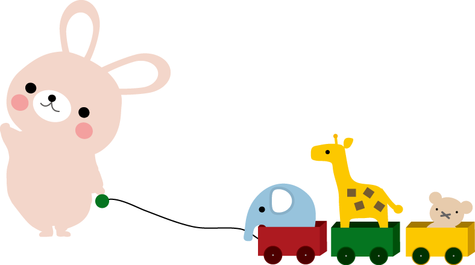
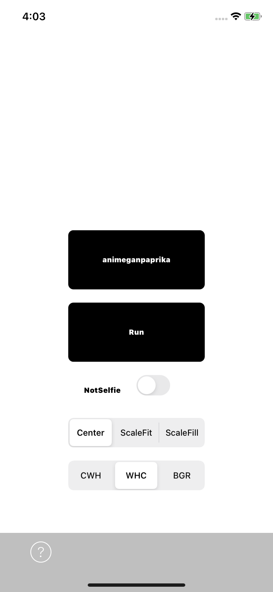
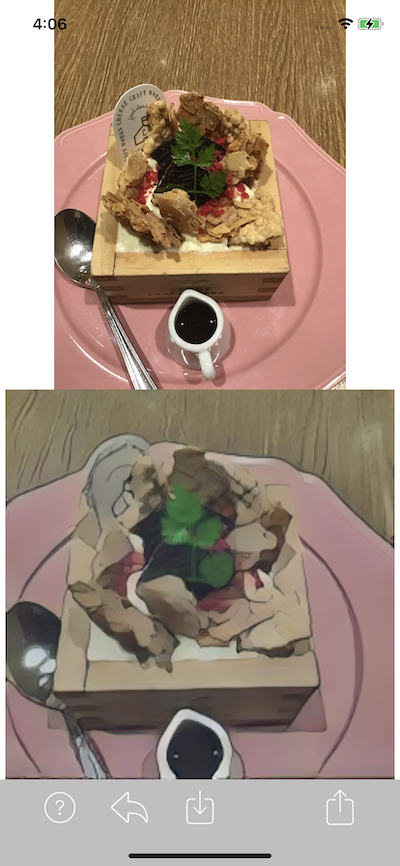

# CoreGANContainer

You can test your Core ML image generation Models.

## Usage

**Just drag & drop your .mlmodel into the model directory.**

If the input of your model is random seeds, they automatically added to the model. 

If the input of your model is an image, You can choose the input image from Image Picker Controller.

It also supports video input.

　⇨　

## Converted Core ML GAN Models

[CoreML-Models(GitHub)](https://github.com/john-rocky/CoreML-Models.)

## Special Thanks
This project is inspired by [MLModelCamera:Shu223](https://github.com/shu223/MLModelCamera).
