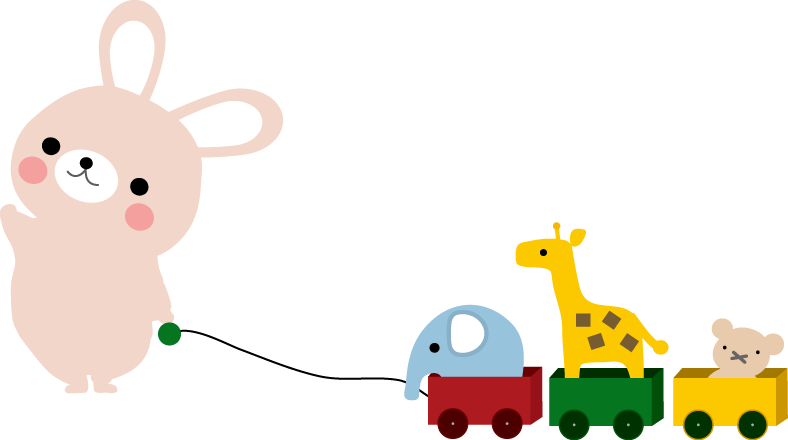
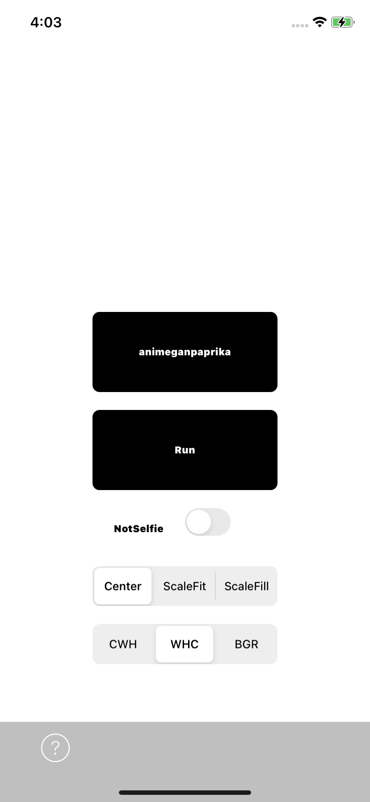
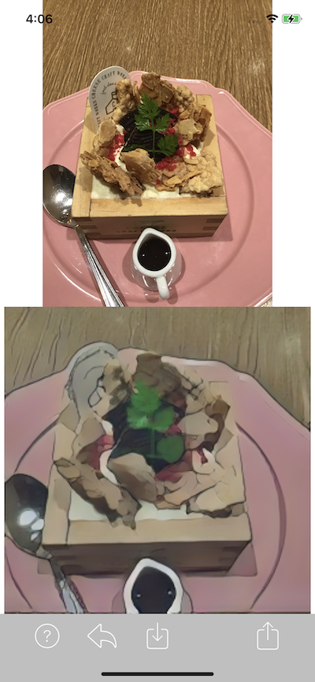

# CoreGANContainer

**GANs (StyleGAN, Pix2Pix, AnimeGAN, CycleGAN) converted to Core ML — runnable on iPhone with sample iOS apps.**

By [Daisuke Majima](https://john-rocky.github.io). Maintainer of [CoreML-Models](https://github.com/john-rocky/CoreML-Models) (1,749★) and 134 OSS repos covering most production on-device ML conversions for iOS.

📱 Powers [AnimateU](https://apps.apple.com/us/developer/daisuke-majima/id1350309854) and other apps on the App Store under my developer account.

💼 **Open to Staff / Senior iOS / Mobile ML roles** — [john-rocky.github.io](https://john-rocky.github.io)

---

# CoreGANContainer

You can test your Core ML image generation Models.

## Usage

**Just drag & drop your .mlmodel into the model directory.**

If the input of your model is random seeds, they automatically added to the model. 

If the input of your model is an image, You can choose the input image from Image Picker Controller.

It also supports video input.

　 ⇨ 　

## Converted Core ML GAN Models

[CoreML-Models(GitHub)](https://github.com/john-rocky/CoreML-Models.)

## Special Thanks
This project is inspired by [MLModelCamera:Shu223](https://github.com/shu223/MLModelCamera).
